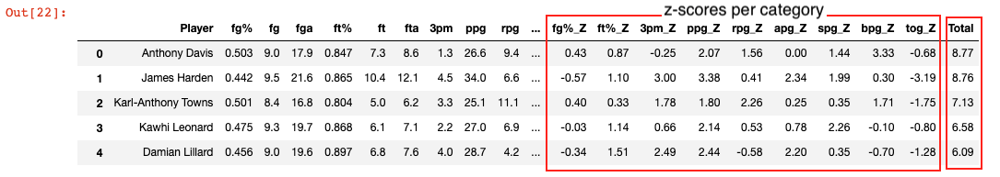
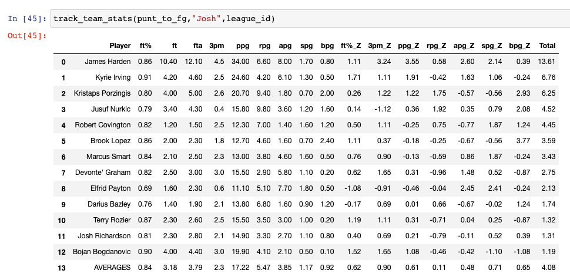
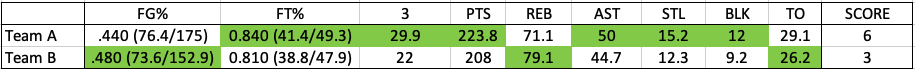

# Punt Kings

Punt Kings is here to help you gain that competitive edge in your 9 Category Fantasy Basketball leagues!

### What is Punt Kings?

Punt Kings is a platform for fantasy managers that projects player performances, provides a value report of every
 fantasy-relevant NBA player, and optimizes a user's team during the draft process. Punt Kings will implement 
 a ***"punting"*** strategy that will strengthen any fantasy basketball team. 

#### The Process:

1) Project individual player performances for the upcoming NBA season.
2) Construct a statistical strengths/weaknesses profile for each player.
3) Provide an interactive draft tool that presents the best available player information, overall team 
strengths  and weaknesses relative to the rest of the league, and the type of statistics to target in any given
round all simultaneously during a fantasy draft. 

### What is a 9 Category (9-Cat) format in fantasy basketball?

Unlike fantasy football or points format fantasy basketball that uses a standardized point system for all statistics,
**9-Cat format compartmentalizes a head to head match-up into 9 different categories based on 9 basketball 
statistics in an NBA game**. Every fantasy team in a weekly match-up battles to win out the majority of the 9 categories.

The 9 categories aggregated from weekly match-ups are:

1) Field Goal Percentage (FG%)
2) Free Throw Percentage (FT%)
3) Three Points Made (3PM)
4) Points (PTS)
5) Rebounds (REB)
6) Assists (AST)
7) Steals (STL)
8) Blocks (BLK)
9) Turnovers (TO)

For every category a team outperforms the other team in is 1 point out of the 9 possible points. 

#### *Example: Team A ("PANDEMIC P") vs. Team B ("BrookLopez3rdRdPlz")*

Team A wins the following categories:
1) FT% (higher percentage than Team B)
2) 3PM (more 3 pointers made than Team B)
3) PTS (scored more points than Team B)
4) REB (collected more rebounds than Team B)
5) AST (tallied more assists than Team B)
6) STL (more steals than Team B)
7) BLK (more blocks than team B)

Team B wins the following categories:
1) FG% (higher percentage than Team A)
2) TO (generated less turnovers than Team A)

***Team A wins 7-2.***

*Depending on your league settings, your overall season record is either 1) aggregated by your weekly score (Team A would 
have an overall record of 5-4 and Team B, 4-5) or 2) a win is 1-0, a loss is 0-1, and a tie is 0-0-1.*

The ultimate goal, of course, is to win a fantasy championship: getting into the playoffs and winning out all the head
to head match-ups by winning majority of the categories every week.

---
## Punting = Focus + Strength!

### What is "punting" and why use a "punting" strategy?

##### The What
- Implementing a "punting" strategy is where the competitive edge comes into play for your fantasy team. 
- Instead of spreading out your team thin by ambitiously attempting to be good in all 9 categories, 
the idea of punting is to focus the attention on a number of categories, and in effect "excluding" ("punting") 
1 or 2 categories.

##### The Why
- When building a team and focusing on 8, 7, or 6 specific categories (depending on personal preference/strategy),
you are effectively GREAT at those focused categories, increasing your team's likelihood of
 winning out majority of the categories in a head to head match-up.
- When focusing on specific categories, you will in effect "punt" or "defer" other categories.

##### Common Mistakes with Punting
- The concept of punting is commonly interpreted as "wanting to be BAD in a category". 
    That is far from what punting accomplishes. If a manager opts for a punting free throw percentage strategy, 
    the manager should not be actively looking for players that are bad at shooting free throws.
- Instead, the manager should look for the best player and not be alarmed by a poor free throw percentage. Managers
    commonly fall into the trap of tunnel vision only looking for players that have a poor free throw percentage 
    thinking this automatically means they are strengthening in other categories. The focus should still be looking
    for the best value regardless of poor free throw shooting. 
- There is a fine line to punting and if not careful the team could be hyper focused in 4 categories and be extremely
    strong in 4 categories, but then extremely weak in 5 categories. This will not increase the likelihood of winning 
    week in and week out, and the manager, when building with a punt strategy should use Punt Kings to monitor that 
    fine line. 

**Optimization and tracking of team stats is crucial, and this is why/how Punt Kings will provide value to fantasy 
    managers that want a easy to follow guide in building the optimal team.**

---

## First Phase: The Data Science Process
### The Data

The data used for modeling and projections are from [Basketball Reference](https://www.basketball-reference.com/)

Basketball Reference contains season total data for every player recorded in the NBA.

This data used for our projections dates back to the 1990 NBA season and every season on has been 
scraped and cleaned for modeling.

### Data Preparation

The concept of our modeling procedure is to create individual models for each statistic needed for projections.

The seasonal statistics we are targeting are:
1) Total points
2) Total field goals made (both 2 point and 3 point makes)
3) Total field goal attempts
4) Total 3 pointers made
5) Total 3 pointers attempted
6) Total free throws made
7) Total free throws attempted
8) Total offensive rebounds
9) Total defensive rebounds
10) Total assists
11) Total steals
12) Total blocks
13) Total turnovers
14) Total games played
15) Total games started
16) Total minutes played

**There will be 16 total models to predict these 16 statistics.**

These predictions will be used to calculate per game stats for the 9 categories. 

With feature engineering and gathering variables that may help predict performance, we will gather all the previous
season data and train the data to predict the next season's target stat (one of the 16 targets mentioned above). 

## Prediction

Models:
1) Linear Regression
2) Lasso
3) Ridge

We will prepare train/test data and validate the data with all three models. 

**A method will fit all 3 models and extract the best performing model for each specific statistic as our
go-to model for that statistical model.**

## Results

The following chart shows the root mean squared error of our models for every predicted statistic. 
These statistics is a representative of total stats for an entire season (maximum 82 games per season).

The baseline model we are comparing the metrics with is simply replicating the previous season's statistic. 
Essentially we are comparing *'if we just predict that a player will repeat last season's performance is that a
better prediction than our models?'*

Ideally we want our models to perform better than this baseline.

As we can see from the results, free throw attempts, offensive rebounds, blocks are the 3 predictive statistics of the 
total 16 predicted stats that performed worse than the baseline model. For future development/predictions we may opt
to replicate a player's previous season performance for those specific statistics for future projections.

Nonetheless the models have performed fairly well compared to the baseline.

### Punt Kings' Final Projections for 2020-21 NBA Season (Preview)

Our final product of projections would look as such:

*These projections are created by applying averages based on games projected.*

---
## Second Phase: Assigning Values to Players

*Disclaimer: The following projection data used from this point on are extracted from 
[HashtagBasketball.com](https://hashtagbasketball.com/fantasy-basketball-projections) projections, by Joseph Mamone
(Twitter: [@josephmamone](https://twitter.com/josephmamone)). The rest of the concepts and development is carried
on through the Punt Kings project.*

At this phase of Punt Kings, we will assign values to every NBA player to identify the top players to draft for your
fantasy team.

How values are calculated:
- For every category of the 9 total categories, we will calculate the **Z-score** for every NBA player.
- A player's **total** value is found by the net result of all 9 z-scores summed together. 

The following image showcases and ranks the top fantasy basketball players. Again, this is using HashtagBasketball's
projections, but this concept could be applied with any data frame of player projections.

Here we can find the categorical strengths of each NBA player. For example, Anthony Davis, the highest ranked player,
has a great all around game compared to the average NBA player. He is excellent in blocks, rebounds, steals, and scoring,
with his weakness being 3 pointers, assists, and turnovers. Still relative to other NBA stars he is still a great all
around fantasy player and should generally be taken in the top 3 picks of fantasy drafts. 

### Punt Values

*Now we can re-calculate a player's value by punting/removing certain categorical weaknesses of a player.*

If you want to implement a field goal percentage and turnover punt strategy (indifference to low efficient
field goal shooters and high turnover rates), you can maximize the value of players with the following rankings:

#### Punting field goal percentage

On the other hand, if you want to implement a free throw percentage and turnover punt strategy, you would notice
Giannis Antetokounmpo jumps into a top player to draft. Though there may not seem to be much change, that is due
to the top players having great overall value that a punt method won't tarnish their worth. The values and rankings
signficantly change past the top 10 players. 

#### Punting free throw percentage

These rankings are great to reference to understand what players are good in what categories and how to build your team
accordingly. Still, even with this information it can be difficult to keep track during a draft. That is why this project
also creates a draft tool for users to use during a draft that will provide best available players for a specific
draft strategy and to keep track of the players already drafted. 

---
## Third Phase: Punt Kings Draft Tool

*This draft tool currently only supports Yahoo Fantasy leagues.*

There are 3 main features to this draft tool. 
1) Show best available players overall
2) Show best available players based on a punt strategy
3) Track your team build during the draft

As of (12/19/2019), this draft tool is only ran through a back end Jupyter Notebook that will require a Yahoo league
id to scrape information in real-time.

The following will demonstrate from a back-end perspective of how this draft tool can help simplify the drafting process.

**For this demonstration we will implement a PUNT FIELD GOAL PERCENTAGE AND TURNOVER strategy**

This is what a typical draft room looks like in Yahoo:

- As you can see there is a Yahoo XRank already attached to a player. 
- It is crucial to notice where players are in the XRank. 
- The point of the draft tool is to optimize value. So drafting a player close to its XRank is the best way to 
optimize value. 
- (This means just because our punt rankings has a player ranked at top of the list, it doesn't mean
you should draft them ahead of all the players above them in XRank. The general range you should "reach" for a player
is 1-2 rounds. Confusing I know! Hopefully if you continue along it will make more sense.)

The first draft tool feature is to show best available players overall and we can see that here (note: this method
can be ran at any point of the draft):

- The best available rankings without punting anything shows Anthony Davis as the number 1.
- Yahoo XRank has Anthony Davis at 3.
- Our draft tool suggests we should NOT be drafting Luka Doncic #1 overall. 
- Although he is a young talent and a lot of hype building around him, our numbers suggest he should really be a 
mid first round type player. 
- This shows how we must be aware of Yahoo's XRanking of players and where we have the players in our rankings.

**Since we are using a punt FG% and TO strategy, let's take a glimpse of the punt rankings:**

**We have the #1 overall pick in this Mock Draft, so we will go ahead and select James Harden**

- After selecting James Harden as he is ranked first in our punt rankings, we can run our "Track Team Stats" method:

- Here, we can see James Harden is assigned to our team and we can see our projections in a data frame.
- This will continue to build with more of our selections.

**Notice whenever a selection is made in the draft room, the information is passed in real time for our best available
and removing the players from the available players list**

 

**Now as we are approaching the tail end of the 2nd round and beginning of the 3rd round this is a look at the
draft room as well as the best available updated in real-time:**

### 2nd and 3rd Round Selection Logic/Thought Process

- It just so happens Kyrie Irving is the best available from both Yahoo's XRank as well as our Punt Rankings, so our 
second pick will be **Kyrie Irving**.
- The third round is where it gets interesting. According to Yahoo, the next best player
is Ben Simmons. With our player profiles, we know Ben Simmons struggles as a three point shooter and a free throw
shooter. That is why he is nowhere to be seen in our punt rankings and it is wise to avoid selecting him here.
- As mentioned earlier about the **importance of XRank awareness and optimizing value**, it may seem like the best
available method is suggesting to draft Kristaps Porzingis. He is lower in Yahoo XRanks due to his injury status and
potentially being out for the first month. Knowing this, we could wait the next rounds to select him there. That is
optimizing our selections!! We can hope Porzingis drops to us in rounds 4/5. **That is why XRank awareness is CRUCIAL!!**
- There are a couple of great options for our 3rd selection: Fred VanVleet (XRank: 36), Zach LaVine (XRank: 30),
Shai Gilgeous-Alexander (XRank: 26) to name a few. These XRank differences to punt value are miniscule so we 
could go with any of your personal preferences/beliefs in confidence. 
- However, knowing I selected two point guards to build my team, I would like to look at a big man here, and there are
2 that catch my eye and are in the best available method: Jusuf Nurkic, Nikola Vucevic. Knowing they won't be there for
me in round 4/5, I will select **Jusuf Nurkic**.

**Tracking team stats after the first 3 picks:**

*We can see how are team is looking with the first three picks and to have an idea what we need to target for the next
rounds*

**Continue this process for the rest of the rounds...Fast forward and this was the final team:**

***Let's compare two teams: 1) Team A using Punt Kings, 2) Team B taking the best available player based on XRank:***

***Tracking Team A draft projected average stats:***

***Tracking Team B draft projected average stats:***

**To demonstrate the final results of what punting accomplishes let's put Team A and Team B in a hypothetical 
head to head based on every players projected averages:**

### *Voila~~ TEAM A WINS 6-3*

Team A's punt strategy was a success in the sense that "ignoring" bad field goal percentages and high turnovers, Team A 
in effect got stronger in focused categories.

It should be noted that there is going to be variance (as you can see with low rebounding numbers) 
where there is correlation at play when sacrificing specific categories. In this case, Team A's rebounding numbers
are lower than Team B's due to a hyper-focus on valuing players that have high usage with scoring/assists which implies
more guard play and less big men, hence lower rebounding. 

These correlations can be applied to any punt strategy and with more experience the fantasy manager should be careful
in not giving up more than 3 categories. 

---

### Conclusion

Ultimately the draft process is fully unpredictable. There will be players that fantasy owners will reach for that will
change the entire frequency of the draft. This tool will provide an assistance to the chaos of a draft as there are time
limits per selection. 

***It is crucial to understand that Punt Kings is not designed to completely automate the draft process.***

#### Requirements:
- The fantasy owner must apply their own personality and fun in building your team. Draft the players you enjoy watching!
- Understand where players are generally being taken and in what rounds to understand where the value is in every round.
- It is good to have a strong categorical awareness of players and knowing each player's strengths/weaknesses.
- The draft isn't the only way to win leagues. It is a great way to build a strong foundation, but stay active
during the season with waiver pickups.  

Now go out there and have some fun and go dominate your leagues!!

---

### Future Work

This is far from a finished project and there are many things needed to improve projections and implementation.

1) Add more features to data for modeling (draft class? age? ligament-type injury history?)
2) Need a way to understand a player coming off an injury. Current projections do not account for a player that got
injured in the previous season, or is expected to have higher usage the following season.
3) Predictions for rookies that have no historical data in the NBA.
4) Implement ongoing projections during the season based on recent performance (forecasting)
5) Create a simplified and clean front end experience draft tool that can be used by any user

